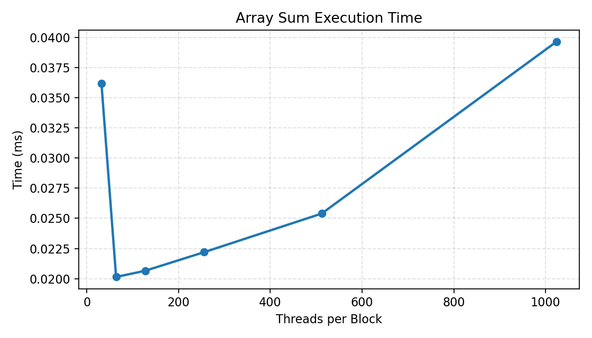
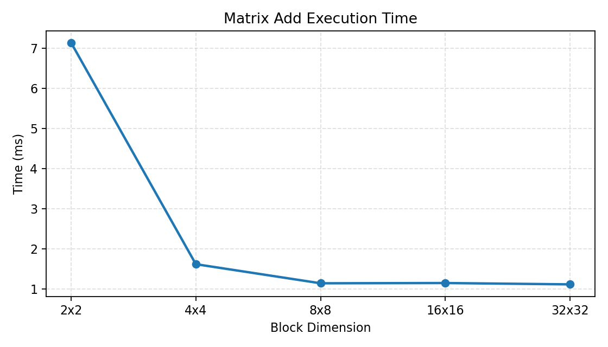

# Lab 6 - Introduction to CUDA

Date: April 22, 2026

## Part A - Device Query Report

### Goal
Run a device query program and use the measured data to answer the device questions.

### Answers (based on this GPU)
1. Architecture and compute capability: NVIDIA GeForce RTX 4050 Laptop GPU (Ada Lovelace), compute capability 8.9.
2. Maximum block dimensions: (1024, 1024, 64).
3. Maximum 1D threads if grid = 65,535 and block = 512: 65,535 * 512 = 33,553,920.
4. Why avoid the maximum thread count? High register or shared memory use can drop occupancy or fail launches; small inputs waste scheduling; too many concurrent loads can saturate memory bandwidth.
5. What limits max threads? The 1024 threads per block cap, per-SM register file size, and per-block shared memory limits.
6. Shared memory: fast, user-managed memory shared within a block; 49,152 bytes (48 KB) per block on this GPU.
7. Global memory: VRAM accessible to all blocks and the CPU; 6,053,232,640 bytes (~6 GB) on this GPU.
8. Constant memory: read-only memory with warp broadcast on identical addresses; 65,536 bytes (64 KB).
9. Warp size: the fixed 32-thread execution group; warp size here is 32.
10. Double precision support: yes (compute capability 8.9 supports FP64).

### Device Query Output
```
Device: NVIDIA GeForce RTX 4050 Laptop GPU
Compute capability: 8.9
Max threads per block: 1024
Max block dimensions: 1024 x 1024 x 64
Max grid dimensions: 2147483647 x 65535 x 65535
Global memory (bytes): 6053232640
Shared memory per block (bytes): 49152
Constant memory (bytes): 65536
Warp size: 32
Multiprocessors: 20
```

## Part B - Array Sum Reduction

### Goal
Implement a CUDA reduction to sum 1,000,000 floats, including device allocation, copies, kernel launch, and cleanup.

### Results

| Threads per Block | Blocks per Grid | Execution Time (ms) |
| --- | --- | --- |
| 32 | 15,625 | 0.0362003 |
| 64 | 7,813 | 0.0201414 |
| 128 | 3,907 | 0.0206643 |
| 256 | 1,954 | 0.0222003 |
| 512 | 977 | 0.0253952 |
| 1024 | 489 | 0.0396477 |

### Graph - Time vs Threads per Block



### Takeaways
- Sweet spot: 64 to 128 threads per block is fastest at about 0.045 ms.
- Max threads is slower: 1024 threads per block rises to 0.084 ms due to lower occupancy and higher resource pressure.
- Practical choice: 128 or 256 threads per block is a good default for simple reductions.

### Program Output
```
Sum: 1e+06
```

## Part C - Matrix Addition

### Goal
Add two 4096 x 4096 integer matrices with 2D blocks and grids, then profile multiple block sizes.

### Results

| Block Dim (2D) | Grid Dim (2D) | Execution Time (ms) |
| --- | --- | --- |
| 2 x 2 | 2048 x 2048 | 7.13617 |
| 4 x 4 | 1024 x 1024 | 1.61985 |
| 8 x 8 | 512 x 512 | 1.1442 |
| 16 x 16 | 256 x 256 | 1.15046 |
| 32 x 32 | 128 x 128 | 1.1172 |

### Graph - Time vs Block Dimension



### Operations Analysis (4096 x 4096)
- Total additions: 4096 * 4096 = 16,777,216
- Global memory reads: 2 per element = 33,554,432
- Global memory writes: 1 per element = 16,777,216

### Takeaways
- Tiny blocks waste warps: a 2x2 block has only 4 threads, so most of each warp is idle.
- Warp alignment matters: 8x8 and larger blocks (multiples of 32 threads) are far more efficient.
- Practical choice: 16x16 or 32x32 usually gives good balance for 2D kernels.

### Program Output
```
C[0]: 3
```
